# Hardware Guide

IE3 is a three-channel in-situ gas chromatograph with electron capture detectors. The hardware system brings ambient air and reference gases to the GC, dries the sample stream, selects the active source with Valco valves, separates target compounds on heated columns, and records detector and engineering data through the acquisition computer.

This guide summarizes the hardware slide deck and keeps the original slide images nearby for reference.

## Slide Reference

  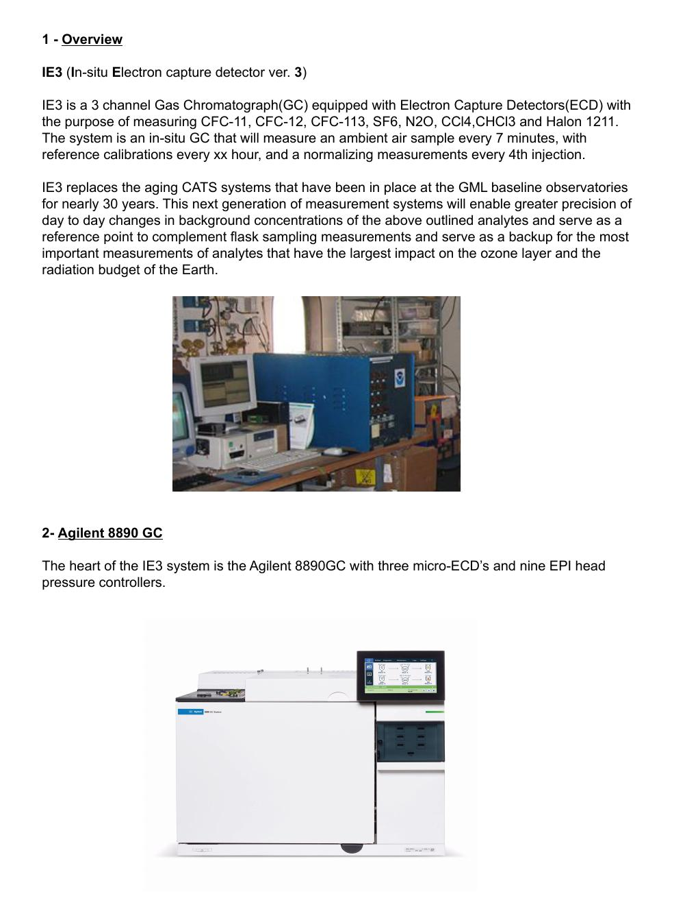

## System Purpose

IE3 stands for in-situ Electron Capture Detector version 3. It measures trace gases including:

- CFC-11
- CFC-12
- CFC-113
- SF6
- N2O
- CCl4
- CHCl3
- Halon 1211

The instrument is designed to replace aging CATS systems at GML baseline observatories. It provides continuous in-situ measurements, complements flask sampling, and gives a backup measurement path for high-priority ozone-depleting and climate-relevant compounds.

## Major Hardware Blocks

| Block | Purpose |
| --- | --- |
| Agilent 8890 GC-ECD | Three-channel chromatograph with micro-ECD detectors and electronic pressure control |
| Pump board | Pulls ambient air from tower Synflex lines and maintains stable delivery pressure |
| Reference gas system | Provides normalizing, high calibration, and low calibration gases |
| Drying system | Removes water before the sample enters the GC |
| Stream Selection Valve | Selects which air or tank source enters the drying and GC path |
| Gas Sample Valves | Load sample loops, inject samples, and support backflush flow |
| Electronics box | Houses Valco HMIs, Omega controllers, LabJack, power supplies, buses, and wiring |
| PCB assembly | Conditions sensor signals and switches solenoid/fan power |
| Column cans | Heated column assemblies for chromatographic separation |

## Agilent 8890 GC-ECD

The Agilent 8890 GC is the heart of the IE3 system. It has three micro-ECDs and multiple electronic pressure control channels. The running software sets detector temperatures, makeup flows, and auxiliary pressure programs during normal operation.

The detector outputs are displayed in the IE3 chromatogram window. Elevated detector response indicates compounds eluting from a channel's column.

## Pump Board

  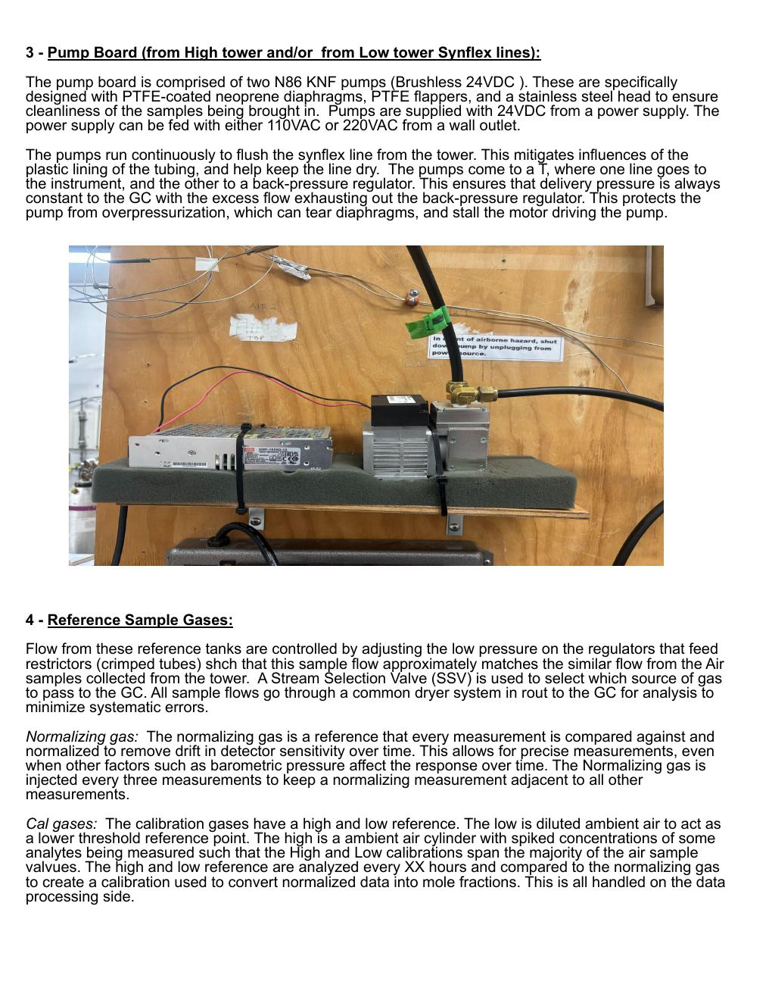

The pump board brings ambient air from high-tower and low-tower Synflex lines. It uses two KNF N86 brushless 24 VDC pumps with PTFE-coated neoprene diaphragms, PTFE flappers, and stainless-steel heads to keep the sample stream clean.

The pumps run continuously to flush the tower lines. This helps reduce tubing effects and keeps the lines dry.

Flow from each pump reaches a tee:

- one path goes to the instrument
- the other path goes to a back-pressure regulator

The back-pressure regulator keeps delivery pressure to the GC stable and protects the pump from overpressure, diaphragm damage, and motor stall.

## Reference and Calibration Gases

Reference tank flow is set with the low-pressure regulator feeding restrictors. The goal is to make tank flow approximately match the air-sample flow from the tower.

All sample and tank sources pass through the common drying system before analysis. This reduces systematic differences between ambient air and reference measurements.

### Normalizing Gas

The normalizing gas is measured frequently and used as the nearby reference for other measurements. This helps remove detector-sensitivity drift and pressure-related response changes over time.

### Calibration Gases

The calibration gases provide high and low reference points. The low calibration gas is diluted ambient air. The high calibration gas is ambient air with elevated concentrations for selected analytes. These span the expected air-sample range and are used in downstream processing to convert normalized responses into mole fractions.

## Sample Drying

  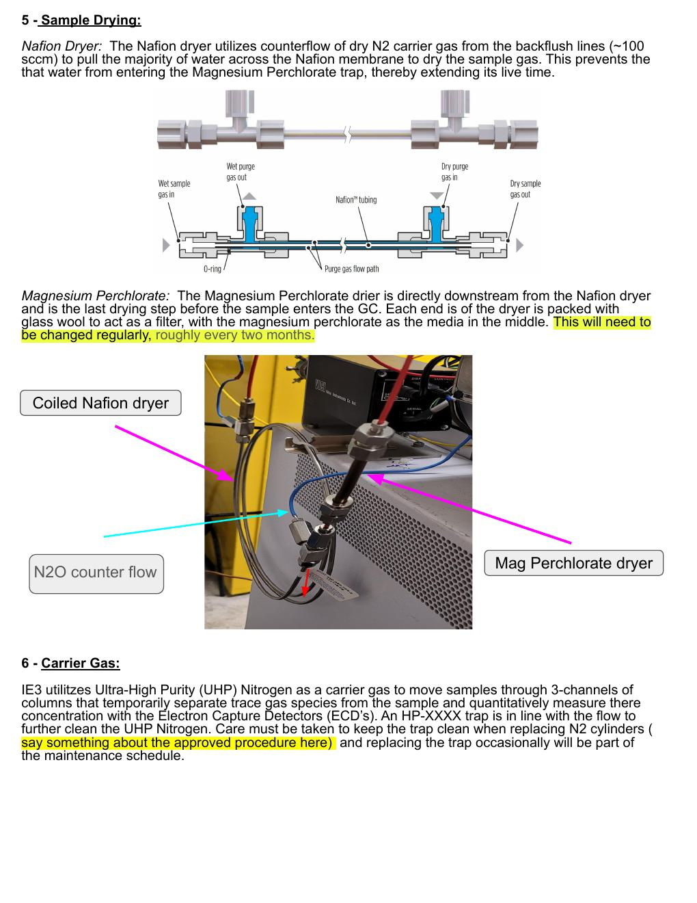

IE3 uses two drying stages before the sample enters the GC.

### Nafion Dryer

The Nafion dryer uses counterflow of dry N2 carrier gas from the backflush lines, about `100 sccm`, to remove most water through the Nafion membrane. This protects the downstream magnesium perchlorate trap and extends its service life.

### Magnesium Perchlorate Dryer

The magnesium perchlorate dryer is directly downstream from the Nafion dryer and is the final drying step before the GC. Glass wool at each end acts as a filter, with magnesium perchlorate media in the middle.

The slide notes estimate replacement at roughly every two months. Treat that as a starting point and adjust based on instrument behavior and local maintenance records.

## Carrier Gas

IE3 uses ultra-high purity nitrogen as carrier gas. The carrier moves samples through the three chromatographic channels and into the ECDs.

An inline trap further cleans the nitrogen. Keep the trap clean during N2 cylinder changes, and follow the approved N2 change procedure so the GC is not left without carrier gas.

## GC Plumbing and Source Selection

  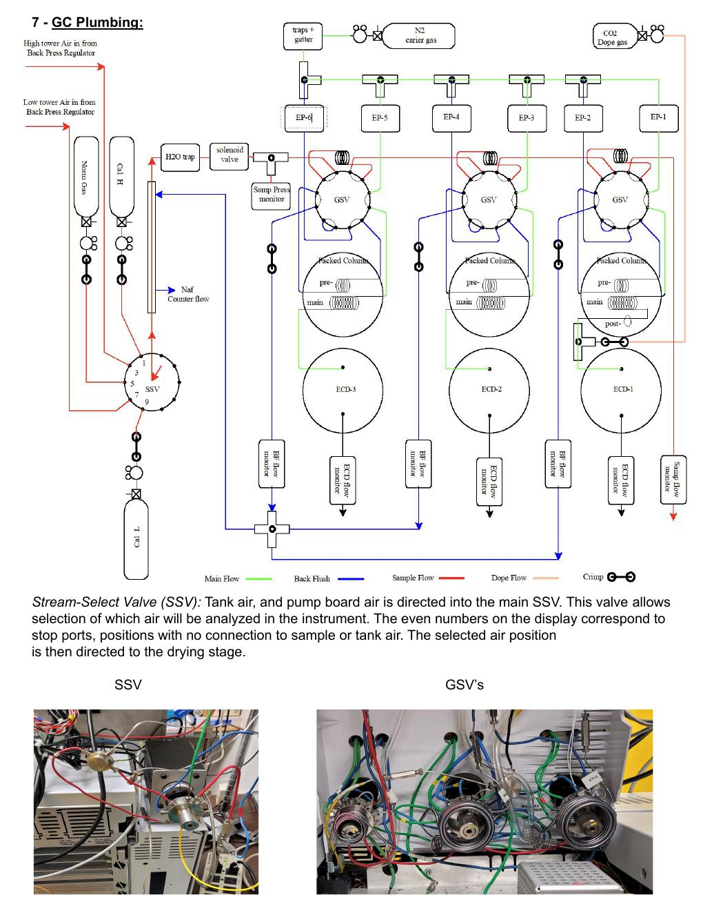

The Stream Selection Valve selects which source is sent to the drying stage and GC:

- calibration and reference tanks
- `air1`
- `air2`
- stop ports

Even SSV positions are stop ports. Odd positions are sample or tank sources in the current configuration.

After the SSV, the selected source flows through the dryer system and then to the Gas Sample Valves.

## Gas Sample Valves and Chromatography

  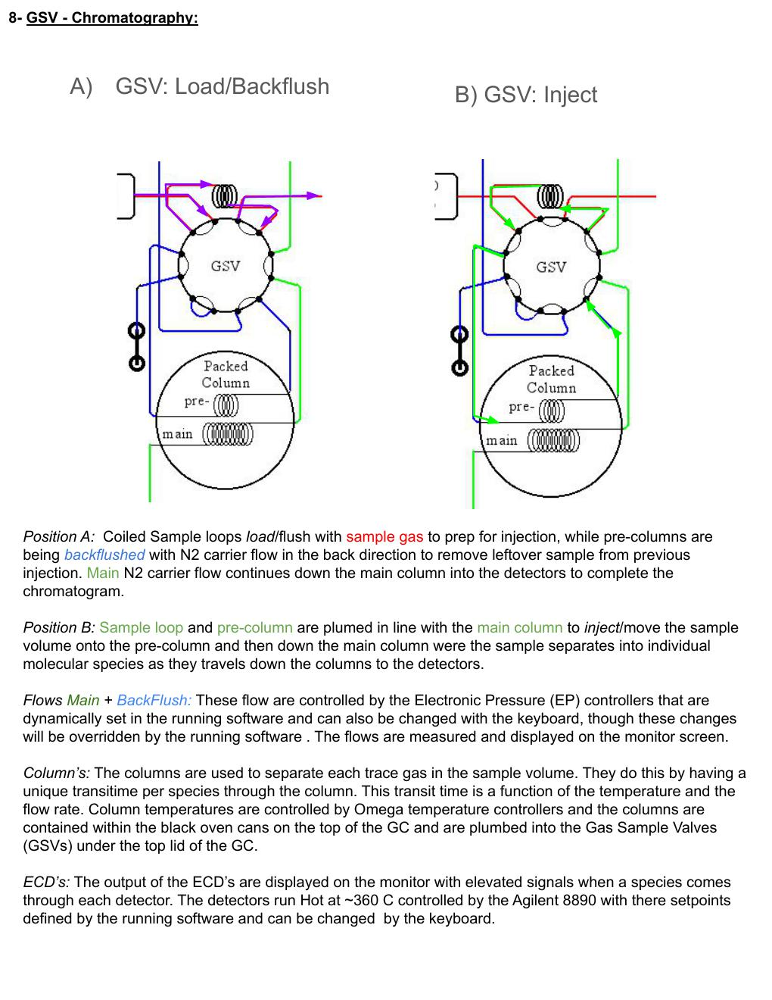

Each chromatographic channel has a Gas Sample Valve.

### Position A: Load and Backflush

In position A, the coiled sample loop loads and flushes with sample gas. At the same time, pre-columns are backflushed with N2 carrier flow to remove leftover sample from the previous injection. Main carrier flow continues down the main column and into the detector to complete the chromatogram.

### Position B: Inject

In position B, the sample loop and pre-column are plumbed in line with the main column. The sample volume moves onto the pre-column and then down the main column, where target compounds separate before reaching the detector.

### Flows, Columns, and ECDs

Main and backflush flows are controlled by electronic pressure controllers. Operators may be able to change values from the GC keyboard, but normal running software will override those changes.

Column temperatures are controlled by Omega temperature controllers. The columns are mounted in the black oven cans on top of the GC and are plumbed to the Gas Sample Valves under the GC top lid.

The ECDs run hot, about `360 C`, with setpoints defined by the running software.

## Electronics Box

  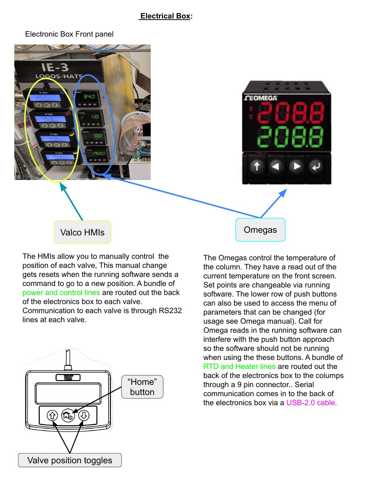

The electronics box contains the front-panel valve controls, Valco HMIs, Omega controllers, LabJack interface, power supplies, AC buses, and internal wiring.

### Valco HMIs

The Valco HMIs can manually control valve positions. Manual valve changes are temporary because the running software will reset valve positions when it sends its next command.

Power and control wiring exits the electronics box and runs to each valve. Valve communication uses serial lines routed through the control wiring.

### Omega Controllers

The Omega controllers maintain the column-can temperatures. Each controller reads its sensor, drives a heater, and communicates with the acquisition computer.

The front-panel buttons can access Omega menus, but software polling can interfere with manual front-panel operation. Do not use the buttons for configuration while the IE3 software is running unless the maintainer has directed that procedure.

## Electronics Box Cabling and Internal Power

  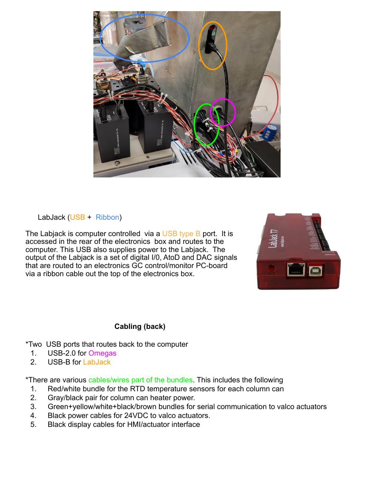

Important cabling includes:

- USB 2.0 for Omega communication
- USB-B for the LabJack T7
- RTD temperature-sensor bundles for the column cans
- heater power pairs for column cans
- serial communication bundles for Valco actuators
- 24 VDC power cables for Valco actuators
- display cables for the HMI/actuator interface

  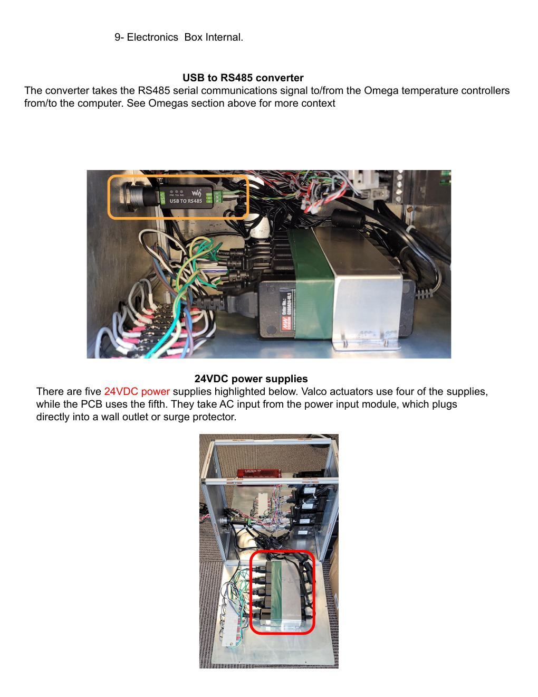

The box includes five 24 VDC power supplies. Four power Valco actuators, and one powers the PCB. AC power enters through the rear power input module and is distributed by internal AC power buses to the 24 V supplies and Omega controllers.

## LabJack T7

The LabJack T7 is the interface between the acquisition computer and the IE3 PCB. It connects to the computer by USB-B and routes digital I/O, analog-to-digital readings, and DAC signals through a ribbon cable to the PCB.

The LabJack provides the acquisition software with engineering data such as pressures, flows, temperatures, and digital output states.

## Top Cover and Sample Path Detail

  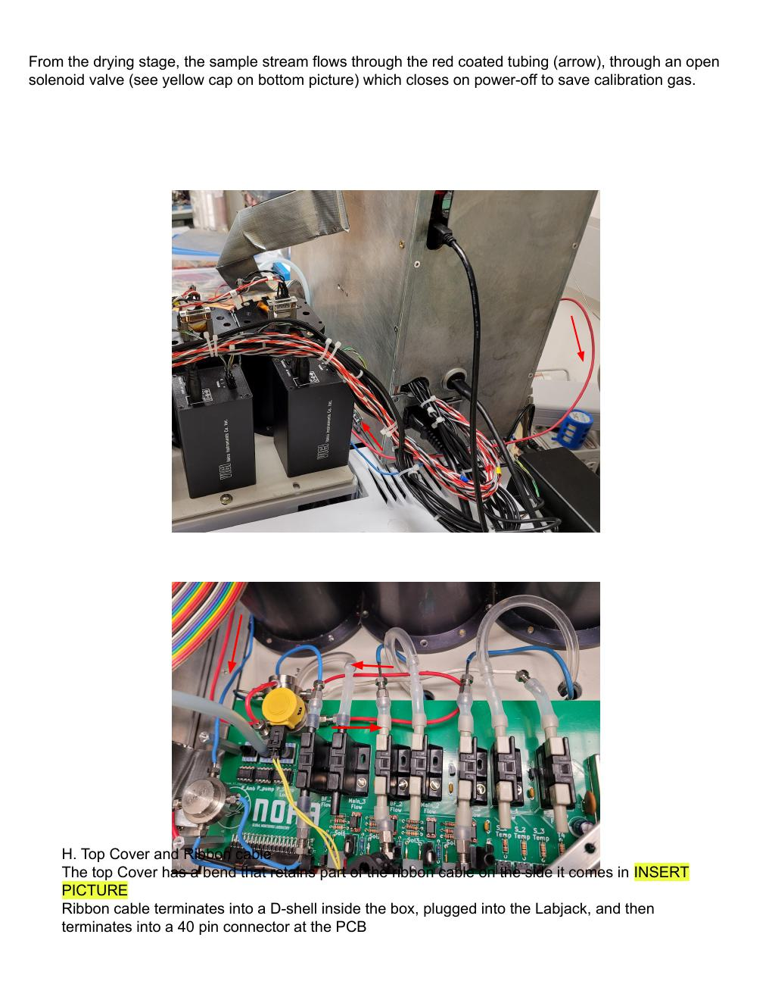

The selected sample stream flows from the drying stage through coated tubing and an open solenoid valve before reaching the Gas Sample Valves. The solenoid closes on power-off to help prevent calibration gas loss.

The ribbon cable exits the top cover, terminates into a D-shell inside the electronics box, connects to the LabJack, and terminates at a 40-pin connector on the PCB.

## PCB Assembly

  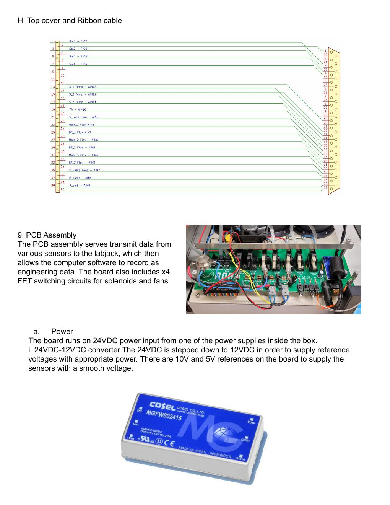

The PCB assembly transmits sensor data to the LabJack and switches 24 VDC loads for solenoids and fans.

Main PCB functions:

- 24 VDC input power
- 24 VDC to 12 VDC conversion
- circuit protection fuse
- 10 V references for flow sensors and thermistor circuits
- 5 V references for pressure sensors
- flow-sensor signal conditioning
- pressure-sensor signal conditioning
- thermistor voltage-divider circuits
- FET power switching circuits
- ribbon-cable connection to the LabJack

### Flow Sensors

  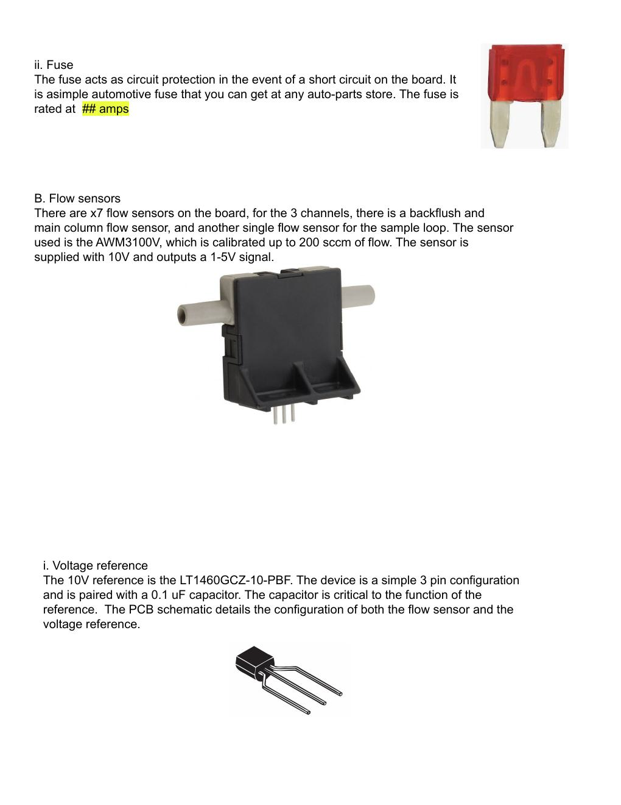

The board has seven flow sensors: main and backflush flow for each of the three channels, plus one sample-loop flow sensor. The slide identifies the sensor as `AWM3100V`, supplied with 10 V and producing a 1-5 V signal.

### Pressure Sensors and Thermistors

  

The board has three pressure sensors, each supplied by its own 5 V reference. The slide identifies the pressure sensor as `HSCDANN030PAA5`, rated for 0-30 psia with a 0-5 V output.

Thermistors use voltage-divider circuits with 10 kohm resistors. There are connector positions for four thermistors: one per channel and one ambient temperature sensor.

### FET Switching

  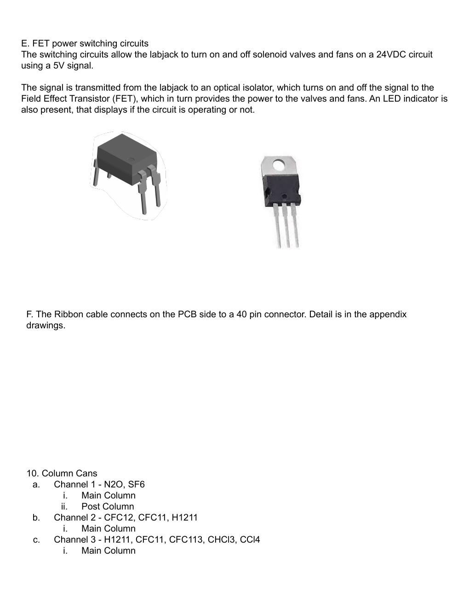

FET switching circuits let the LabJack control 24 VDC solenoids and fans from low-voltage control signals. The LabJack signal drives an optical isolator, which switches the FET. LED indicators show whether the circuit is active.

## Column Cans

The column cans hold the chromatographic columns and heaters.

| Channel | Target compounds noted in slide deck | Columns |
| --- | --- | --- |
| Channel 1 | N2O, SF6 | main column and post column |
| Channel 2 | CFC-12, CFC-11, Halon 1211 | main column |
| Channel 3 | Halon 1211, CFC-11, CFC-113, CHCl3, CCl4 | main column |

## Valves

IE3 uses:

- three Gas Sample Valves, one per chromatographic channel
- one Stream Selection Valve for sample-source selection

The SSV chooses which gas source is sent to the dryer and GC. The GSVs handle sample loop load, injection, and backflush behavior for chromatography.

## Maintenance Notes

- Keep N2 flowing during normal instrument shutdown so the GC remains clean.
- Follow the approved N2 cylinder-change procedure to avoid contaminating the nitrogen trap or leaving the GC without carrier gas.
- Magnesium perchlorate dryer media is expected to need regular replacement; the slide deck suggests about every two months.
- Do not rely on manual Valco HMI changes while the software is running; the software will command valve positions during the sequence.
- Avoid changing Omega controller settings from the front panel while software polling is active.
- Document hardware changes, cylinder swaps, dryer changes, and unusual flows in the operator log.

## Full Slide Images

The original slide pages are included as rendered images for technician reference:

- [Slide 1](../../assets/hardware/slides/ie3-hardware-slide-01.jpg)
- [Slide 2](../../assets/hardware/slides/ie3-hardware-slide-02.jpg)
- [Slide 3](../../assets/hardware/slides/ie3-hardware-slide-03.jpg)
- [Slide 4](../../assets/hardware/slides/ie3-hardware-slide-04.jpg)
- [Slide 5](../../assets/hardware/slides/ie3-hardware-slide-05.jpg)
- [Slide 6](../../assets/hardware/slides/ie3-hardware-slide-06.jpg)
- [Slide 7](../../assets/hardware/slides/ie3-hardware-slide-07.jpg)
- [Slide 8](../../assets/hardware/slides/ie3-hardware-slide-08.jpg)
- [Slide 9](../../assets/hardware/slides/ie3-hardware-slide-09.jpg)
- [Slide 10](../../assets/hardware/slides/ie3-hardware-slide-10.jpg)
- [Slide 11](../../assets/hardware/slides/ie3-hardware-slide-11.jpg)
- [Slide 12](../../assets/hardware/slides/ie3-hardware-slide-12.jpg)
- [Slide 13](../../assets/hardware/slides/ie3-hardware-slide-13.jpg)
- [Slide 14](../../assets/hardware/slides/ie3-hardware-slide-14.jpg)
- [Slide 15](../../assets/hardware/slides/ie3-hardware-slide-15.jpg)
- [Slide 16](../../assets/hardware/slides/ie3-hardware-slide-16.jpg)
- [Slide 17](../../assets/hardware/slides/ie3-hardware-slide-17.jpg)
- [Slide 18](../../assets/hardware/slides/ie3-hardware-slide-18.jpg)
- [Slide 19](../../assets/hardware/slides/ie3-hardware-slide-19.jpg)
