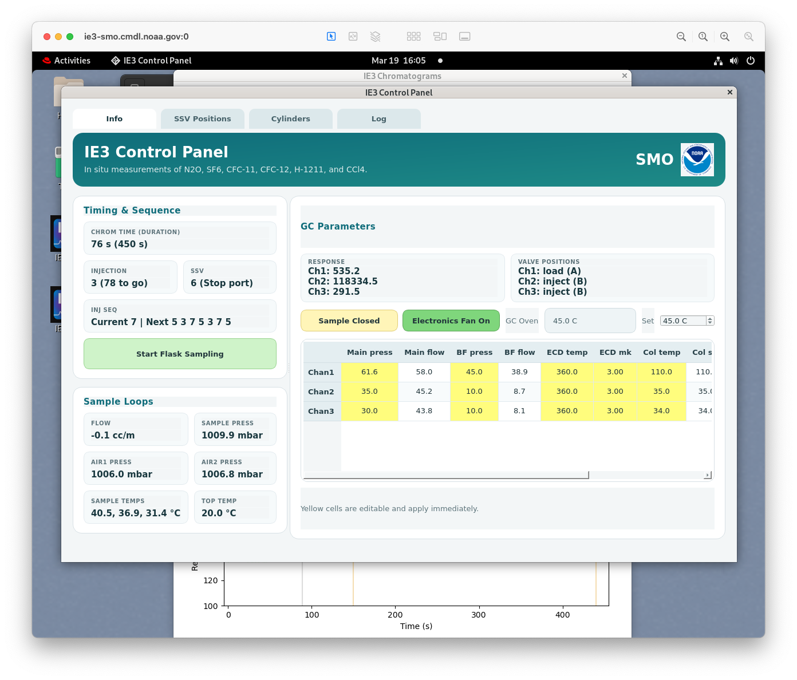

# Technician Guide

IE3 normally runs as a desktop control-panel application on the instrument computer. Technicians use the software to monitor chromatograms, check flows and pressures, record cylinder changes, and leave operator notes for later data review.

## Main Tasks

- [Hardware guide](../hardware/README.md): hardware overview, gas path, photos, electronics, valves, and PCB notes.
- [Daily checks](daily-checks.md): what to inspect during routine operation.
- [Power down and power up](power-cycle.md): full system shutdown and restart procedure.
- [Flow balancing](flow-balancing.md): how to stop the SSV sequence, step through ports, and adjust sample flows.
- [Cylinder pressures](cylinder-pressures.md): how to record weekly pressures, interpret usage projections, and use the `N2 Swap` and `Cal Swap` buttons.
- [Operator log](operator-log.md): how to record events, adjustments, and flask sampling notes.
- [Troubleshooting](troubleshooting.md): common startup, desktop icon, flow, and display problems.

## Normal Screen

  

The most important routine check is visual: know what the three chromatogram channels should look like, and investigate obvious changes in baseline, peak shape, or timing.
