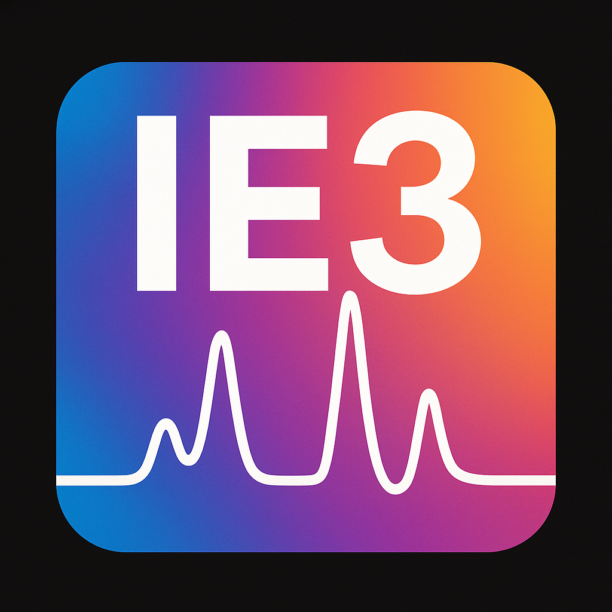

# Troubleshooting

## Desktop Icons Are Missing

If the `IE3 Run` or `IE3 Idle` desktop icons disappear after login or reboot, reload the GNOME desktop-icons extension from a terminal:

```bash
gnome-extensions disable desktop-icons@gnome-shell-extensions.gcampax.github.com
gnome-extensions enable desktop-icons@gnome-shell-extensions.gcampax.github.com
```

## Normal Startup

For normal startup, double click the `IE3 Run` desktop icon.

<p align="center">
  
</p>

If starting from a terminal, run:

```bash
ie3.py
```

## Safe Shutdown

To stop the software safely, close either:

- the chromatogram window
- the `IE3 Control Panel` window

Closing either window should stop the Qt application and run the normal shutdown path.

## Flow Looks Wrong

If one SSV position has poor sample flow:

1. Use the [flow balancing procedure](flow-balancing.md).
2. Confirm the SSV position shown in the `SSV Info` tab.
3. Wait for the live flow reading to stabilize before adjusting.
4. Log the adjustment in the `Log` tab.

## First Injection After Restart

The first injection after software startup or controlled restart is expected to be flagged `SKIP`. This protects downstream processing from using a sample loop that may not be fully conditioned.
